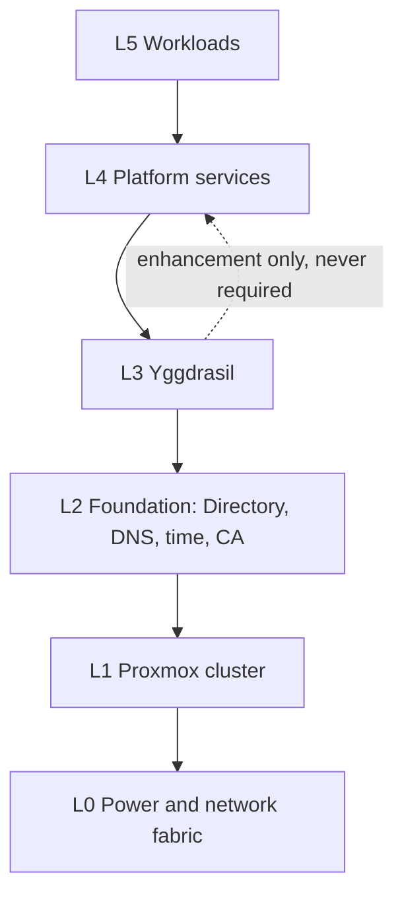
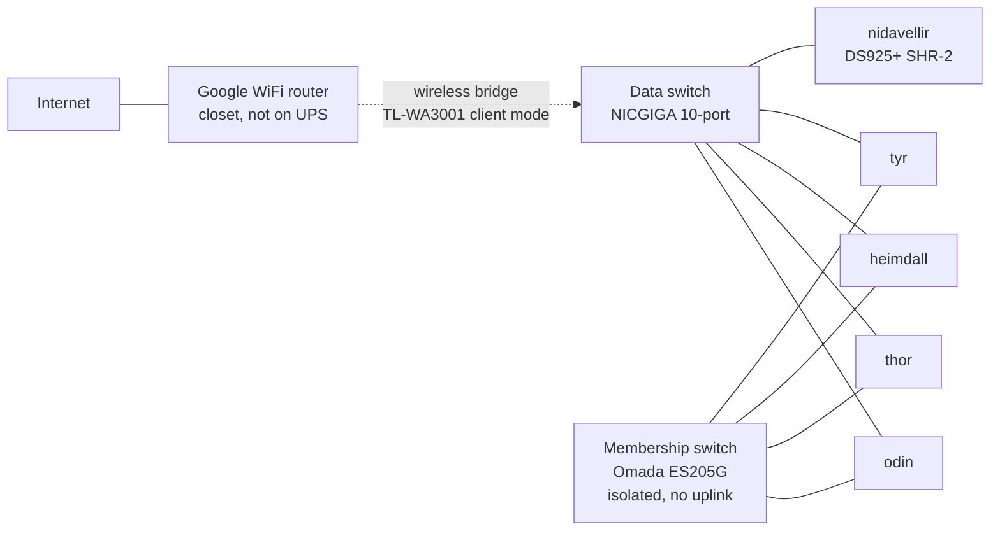
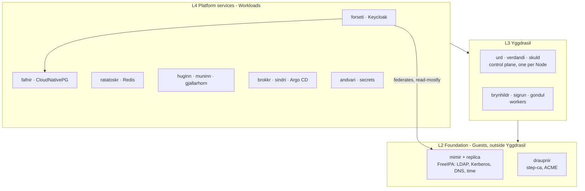
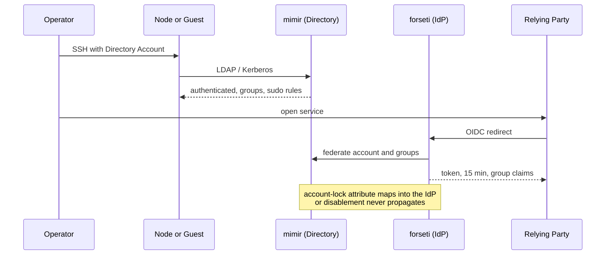

# Architecture Spine — Project Asgard

## Design Paradigm

**Stratified dependency layers with GitOps reconciliation.** Six layers; a layer may depend only on layers strictly below it. Every layer's desired state is declared in the Repository and reconciled toward, never applied imperatively.

| Layer | Contains | Realm |
| --- | --- | --- |
| L0 Physical | Power, network fabric, rack | — |
| L1 Hypervisor | Proxmox cluster on four Nodes | `asgard` |
| L2 Foundation | Directory, DNS, Kerberos, time, platform CA | `mimir`, `draupnir` |
| L3 Platform | k3s, storage classes, gateway, load balancer | `yggdrasil` |
| L4 Platform services | IdP, databases, cache, registry, CI, observability, secrets | `forseti`, `fafnir`, … |
| L5 Workloads | The operator's own applications | — |

The upward-dependency prohibition is the paradigm's single enforceable claim; every circular-dependency failure this design eliminates is an instance of it.

## Invariants & Rules



### AD-1 — No upward dependency into Yggdrasil

- **Binds:** all
- **Prevents:** the cluster becoming unrepairable because the thing needed to repair it runs inside the thing that is broken.
- **Rule:** **No layer may require a higher layer in order to start or to authenticate.** The prohibition is general, not specific to Yggdrasil. Where a lower layer benefits from a higher-layer service, that use is an enhancement with a named independent fallback, never a dependency, and the fallback is exercised by a Procedure rather than assumed. Concretely: the Directory, DNS, time authority, and platform CA run as L2 Guests; the Kubernetes API retains a static administrative credential so IdP-backed `kubectl` is an enhancement; **no controller reconciling L0, L1, or L2 runs as a Workload**; and L1 Nodes must complete boot and admit a Break-glass login with all of L2 unavailable, taking cached or local time, identity, and trust material.

### AD-2 — The Directory owns identity; the IdP federates

- **Binds:** FR-20 to FR-26, FR-30 to FR-36
- **Prevents:** two account stores drifting, and revocation that must be performed twice.
- **Rule:** Accounts and Groups exist only in the Directory. The IdP federates to it read-mostly and stores only sessions, clients, and realm configuration. Creating an Account directly in the IdP is prohibited. The IdP must be rebuildable without loss of identity data. The Directory's account-lock attribute is mapped into the IdP; without that mapping, disablement does not propagate and FR-35 is void.

### AD-3 — Every procedure is dual-form and convergence-tested

- **Binds:** FR-1 to FR-5, NFR-1 to NFR-5
- **Prevents:** documentation and automation drifting until neither is trusted.
- **Rule:** A Procedure is a Runbook **and** its Automation; neither alone qualifies. Every Procedure is listed in the **Procedure Index** in the Repository, which is the authoritative enumeration of "every operational activity". Automation run against a system built by following its Runbook by hand must report zero changes. Any difference is a documentation defect closed at discovery, never accommodated in the Automation.

  **The Runbook standard.** A Runbook is a **complete manual procedure**, executable start to finish with no Automation available. A Runbook that delegates to its Automation — "run the playbook" — does not satisfy this rule, because it is worthless at the one moment it is needed: when that Automation has just failed and the operator must determine what it was attempting. Each Runbook therefore:

  1. States the **actual commands the Automation issues**, in order, rather than referring to the Automation.
  2. States **expected output at each checkpoint**, so a divergence is locatable rather than merely detectable.
  3. **Maps bidirectionally to its Automation** — each Runbook step names the Automation task performing it, and each Automation task names its Runbook section. A failed task must point directly at the section explaining what it was doing and why.
  4. Carries a **failure-mode note** on any step with a known way to go wrong: what the failure looks like, and what to check first.

  This holds regardless of who executes. Where Automation is driven on the operator's behalf, the operator retains responsibility for diagnosis, and the Runbook is what makes that possible.

### AD-4 — The Repository is the sole source of truth

- **Binds:** all
- **Prevents:** configuration that exists only on a running system and dies with it.
- **Rule:** No configuration required to rebuild any component exists solely on a running system. Changes made directly against a running system are either promoted into the Repository or reverted; **how** that is detected differs by layer and is governed by AD-23, because only L3–L5 have a reconciliation loop. Managed network devices, the hypervisor host operating system, and the storage appliance are configuration items under this rule, not exceptions. Provisioning state produced by the declarative tooling is itself a configuration item (AD-22).

### AD-5 — Two certificate authorities with bounded scope; ACME is the only issuance protocol

- **Binds:** FR-27 to FR-29, NFR-11
- **Prevents:** a single CA role becoming an unrecoverable point, and per-consumer bespoke renewal.
- **Rule:** The Directory's integrated CA issues **only** the Directory's own internal certificates. `draupnir` (step-ca) is the platform CA and issues everything else. All platform issuance and renewal happens over ACME — Proxmox natively, Kubernetes via cert-manager, hosts and the NAS via an ACME client. Manual certificate installation is prohibited. The Directory CA renewal role's location, health check, and relocation Procedure are named in the Repository.

### AD-6 — The Directory is the time authority

- **Binds:** FR-20, FR-30, AD-2
- **Prevents:** Kerberos failing platform-wide when the internet uplink degrades.
- **Rule:** The Directory is the authoritative time source. Every Node and Guest synchronises to it; the Directory alone synchronises upstream, and only when the uplink is available. No host synchronises directly to an external source. Kerberos tolerates roughly five minutes of skew, and the uplink is a wireless bridge — internal time coherence must not depend on it.

### AD-7 — Traffic classes are physically separated

- **Binds:** FR-12, FR-65, NFR-16
- **Prevents:** bulk storage load starving cluster membership into a false partition.
- **Rule:** Cluster membership traffic uses each Node's **onboard** interface on the isolated membership switch. Storage, Workload, backup, and outbound traffic use the **added 2.5 GbE adapter** on the data switch. The membership switch has no uplink, no gateway, and carries no other traffic. Membership never traverses the USB-attached adapter — USB Ethernet resets and renumbers, which is tolerable for traffic that retries and intolerable for the signalling that decides whether a Node is alive. Wireless interfaces on Nodes are disabled, not held in reserve.

### AD-8 — Storage placement is determined by I/O class, not convenience

- **Binds:** FR-15 to FR-18, FR-46
- **Prevents:** databases landing on shared spinning disks, and the semantics of a volume being decided ad hoc.
- **Rule:** Nidavellir is HDD-only; nothing performing database-class random I/O is placed on it by any protocol. Placement: **local NVMe** for Guest root disks and database data; **NFS (default class, ReadWriteMany)** for home directories, shared content, and general Workload volumes; **iSCSI (second class, ReadWriteOnce)** where block semantics are wanted. iSCSI provides semantics, not speed — both classes land on the same disks.

  **Mount semantics are decided, not left to the mounter.** Shares are mounted `hard` so that a storage interruption blocks rather than silently corrupting — NFR-17 puts integrity above availability. FR-16's requirement that storage loss degrade rather than hang is met by **automounting** shares so they are absent rather than wedged when unreachable, and by AD-9's Break-glass home directories lying outside every NFS-managed path. `soft` mounts are prohibited.

### AD-9 — Break-glass is independent of the Directory, the NAS, and Yggdrasil

- **Binds:** FR-10, FR-24, FR-55, NFR-12, NFR-13
- **Prevents:** the emergency path failing during the emergency it exists for.
- **Rule:** Every Node and Guest carries a named local administrative account with privilege escalation, unique per host, unmanaged by the Directory. **Its home directory is local and lies outside any NFS-managed path** — local alone is insufficient, since a home nested under the Share's mount point is shadowed while mounted and invisible under an automounter. Direct remote root login stays disabled. Break-glass credentials, the Kubernetes static administrative credential, and the platform CA root key are escrowed outside Asgard.

### AD-10 — Revocation is Directory-driven with per-party bounds recorded

- **Binds:** FR-22, FR-23, FR-35, SM-3
- **Prevents:** believing revocation is instant and uniform when it is neither.
- **Rule:** Disabling one Directory Account is the only action required. Propagation is bounded, not immediate, and each bound is recorded in a per-Relying-Party table in the Repository: IdP-issued access tokens expire within 15 minutes; the host offline credential cache has an explicit maximum age set rather than left at product default; parties that cannot honour 15 minutes — notably the hypervisor UI, which mints its own ticket lasting roughly two hours after OIDC login with no back-channel logout — declare their real ceiling. An unrecorded bound is a defect.

  **The account-lock mapping does not ship and must be built.** The IdP has no built-in mapper for the Directory's account-lock attribute, and the obvious attribute mapper inverts its sense. A verified mapping is therefore a named deliverable with its own test — disable an Account, attempt authentication at each Relying Party, confirm refusal within the recorded bound — and the test is part of the Procedure, not a one-time check. Until that mapping is verified, disablement does not reach the IdP at all and every downstream bound in this AD is void.

### AD-11 — Ordered shutdown is achieved by measured margin, not coordination

- **Binds:** FR-56 to FR-60
- **Prevents:** assuming a handshake that the storage appliance does not implement.
- **Rule:** Nidavellir signals UPS state; it does not coordinate with clients and will not wait for them. Ordering is produced by configured delays: Workloads drain, Guests stop, Nodes stop, Nidavellir last. The margin between the last Node completing shutdown and Nidavellir ceasing to serve is **measured by Drill and recorded as a number in the Repository**, never estimated, and re-measured after battery replacement. All Nodes, Nidavellir, and both switches are battery-backed. The storage appliance's UPS-client roster is capped at five in its interface; four Nodes fit, and a fifth Node would exhaust it — a constraint on growth, recorded here so it is discovered before the hardware arrives rather than after.

### AD-12 — Alerting has three independent paths; infrastructure alerts bypass Yggdrasil

- **Binds:** FR-51, FR-59
- **Prevents:** an alerting system that cannot report its own failure.
- **Rule:** Platform alerts originate in Yggdrasil. Infrastructure alerts (UPS, NAS) originate from the appliances themselves and must not route through Yggdrasil. A dead-man's-switch heartbeat to an external service covers total silence — and because the household router is beyond the UPS's reach, it is the only path that survives a whole-house outage. All three are outbound-only.

  **One heartbeat per independent source, never a shared one.** Two components reporting to a single dead-man's-switch check keeps it green while one of them is dead, which is worse than no check because it manufactures confidence. Each source that can fail independently owns its own check.

### AD-13 — No inbound path exists

- **Binds:** NFR-14, FR-11, FR-13
- **Prevents:** scope creep into exposure that the security posture does not support.
- **Rule:** Nothing in Asgard is reachable from outside the local network. There is no VPN, tunnel, port forward, or public DNS record. The uplink is a wireless bridge carrying outbound traffic only: package retrieval, image pulls, upstream time, and alerts. Internal names resolve only within `asgard.home.arpa`.

### AD-14 — Gateway API is the only north-south routing model

- **Binds:** FR-41, FR-34
- **Prevents:** two routing models coexisting and diverging.
- **Rule:** Workloads are published through Gateway API resources. Ingress resources are not used, including for migration convenience. One load-balancer address serves as the ingress point, with names in `asgard.home.arpa` resolving to it and certificates issued per AD-5. A Workload fronted by authenticating proxy binds only to an address reachable by that proxy; bypass prevention is convention, not network enforcement, because the flat LAN forecloses the segmentation that would enforce it.

### AD-15 — No plaintext secret reaches the Repository

- **Binds:** FR-53, FR-54, NFR-10
- **Prevents:** a credential leaking into Git history, where deletion does not remove it.
- **Rule:** Secret material committed to the Repository is encrypted and unusable without a key held outside it. A commit-time check prevents plaintext. Workload secrets are delivered at runtime and never baked into images; rotating one does not require editing Workload declarations.

### AD-16 — Names come from the Norse registry; realms are tiers, beings are instances

- **Binds:** FR-11, FR-12
- **Prevents:** ad-hoc naming that exhausts itself and stops meaning anything.
- **Rule:** Every Node, Guest, service, and network segment takes its name from the registry in the brief addendum, which is authoritative. Realms name tiers; beings name instances. A new component takes a name from the reserve pool and is added to the registry in the same change.

### AD-17 — The platform is deliberately mixed-OS

- **Binds:** FR-7, AD-3
- **Prevents:** Automation written against one OS family silently failing on the other.
- **Rule:** The hypervisor runs Debian-family; Directory Guests run RHEL-family, because the Directory server is only supported there. Automation is OS-family aware from the first role, and the Procedure Index carries a host-build Runbook per family. A role that assumes one family is defective.

### AD-18 — Service placement is decided by test, not preference

- **Binds:** all L2 and L4 services
- **Prevents:** placement decided per-service by feel, so that the next service added is argued from scratch and eventually lands somewhere that inverts the layering.
- **Rule:** A service runs **inside Yggdrasil by default**. It runs **outside, as a Guest**, if and only if it meets at least one of four tests:

  1. Yggdrasil requires it in order to **start** or to **authenticate** (AD-1).
  2. A layer **below** Yggdrasil depends on it for a function that must survive cluster loss.
  3. It requires host-level identity or network semantics a Pod cannot provide — stable hostname, working reverse DNS, Kerberos service principals.
  4. **Recovering** the cluster requires it.

  Placement is recorded in the table below; adding a service means adding a row and naming which test it met, or stating that it met none.

| Service | Placement | Test met |
| --- | --- | --- |
| `mimir` — Directory, DNS, Kerberos, time | Guest (×2) | 1, 3, 4 |
| `draupnir` — platform CA | Guest | 2 |
| `forseti` — IdP | Yggdrasil | none — Kubernetes OIDC is an enhancement over the static credential |
| `fafnir` — PostgreSQL | Yggdrasil | none — nothing outside the cluster consumes it |
| `ratatoskr` — cache | Yggdrasil | none |
| `sindri` — registry | Yggdrasil | none, with a bounded caveat below |
| `brokkr` — CI runners | Yggdrasil | none |
| Argo CD — delivery | Yggdrasil | none — the cluster does not need it to start |
| `huginn` · `muninn` — observability | Yggdrasil | none — infrastructure alerting bypasses it under AD-12 |
| `gjallarhorn` — alert routing | Yggdrasil | none — the dead-man's switch is the out-of-cluster path |
| `andvari` — secret store | Yggdrasil | none — Break-glass material is escrowed offline under AD-9 |
| MetalLB · Envoy Gateway · cert-manager · CSI drivers | Yggdrasil | cluster components by definition |

  **Registry caveat.** The registry runs inside the cluster it serves, which is circular for a cold start. It is bounded rather than eliminated: platform-critical images — the distribution's own components, the CNI, MetalLB, the gateway, and the registry itself — must come from upstream or the node image cache, never from `sindri`. A Procedure verifies that a cold start succeeds with the registry down.

### AD-19 — Capacity is bounded, owned, and checked before placement

- **Binds:** NFR-6, NFR-7, NFR-9, AD-18
- **Prevents:** AD-18's "inside Yggdrasil by default" quietly spending a budget no single epic can see, until the cluster has no room to schedule anything.
- **Rule:** Capacity is bounded from two sides and both are checked **before** a service is placed, not after: total committed Guest memory stays at or below 90 GB of 128 GB physical, and at least 15 GB remains schedulable within Yggdrasil. Every Guest and every Workload declares an explicit memory limit; nothing relies on default sizing. A change that places a new service records its effect on both sides in the same commit. Worker Guests are sized at 20 GB each — the in-cluster platform subtotal reached roughly 38.5 GB once the IdP and the database moved inside, which left the original 16 GB Workers short of the schedulable floor.

### AD-20 — Versions are pinned, upgraded bottom-up, and watched for end-of-life

- **Binds:** all; Stack
- **Prevents:** silent drift between what the Repository declares and what is running, and discovering a component is unmaintained only when it forces a redesign.
- **Rule:** Every component is pinned to an exact version in the Repository; `latest` is prohibited. Where a distribution package lags upstream, **the distribution version is authoritative** — it is what installs. Upgrades proceed bottom-up through the layers, because the paradigm's dependency direction is also the safe upgrade direction, and each layer's Procedure states its own rollback. Component maintenance status is reviewed on a stated cadence and before any epic that depends on one: end-of-life is a design input, not an incident. Compatibility windows are checked pairwise at pin time — a component outside its own supported range for another pinned component is a defect, not a warning.

### AD-21 — Backup uses each system's native mechanism; a restore is the only proof

- **Binds:** FR-61 to FR-64, NFR-18, SM-5
- **Prevents:** a general-purpose backup layer nobody understands, and backups that have never been read.
- **Rule:** Each class of data is protected by the mechanism its own system provides, and no general abstraction layer is introduced: appliance snapshots and appliance replication for file data, hypervisor dumps for Guests, and the database operator's own continuous archiving for databases. Coverage is enumerated in the Repository; anything not backed up is listed as a deliberate exclusion. **A backup that has never been restored does not count as present** — every class carries an executed, verified restore Procedure. Because database Pods are pinned to a Node by local storage, continuous write-ahead archiving to shared storage is a precondition of that database running at all, not a later backup concern.

### AD-22 — Declarative ownership is total, exclusive, and stated per resource

- **Binds:** all; FR-4, FR-7, FR-64
- **Prevents:** two tools authoritatively declaring the same attribute, and whole systems owned by nobody while the Repository claims full rebuildability.
- **Rule:** Every configurable resource has **exactly one** declaring owner, named in an ownership table in the Repository. Coverage is total: the hypervisor host operating system, the storage appliance, and every managed network device have owners, not just Guests. The provisioning-versus-configuration split is defined by **attribute, not by moment in time** — "the guest's first boot" is not a boundary, because first-boot provisioning sits precisely on it. The provisioning tool declares virtual hardware and the guest's existence; the configuration tool declares everything inside the operating system, **including the addresses and accounts that first-boot provisioning is also capable of setting**. Where a mechanism can express an attribute that belongs to the other owner, leaving it unset is mandatory rather than stylistic. Provisioning state is itself an owned, versioned artefact with a stated location, locking behaviour, and escrow entry.

### AD-23 — Drift is detected on every layer, by a mechanism appropriate to it

- **Binds:** AD-3, AD-4, NFR-20
- **Prevents:** AD-4's promise of a single source of truth being true only for the layers that happen to have a controller.
- **Rule:** Layers 3 through 5 reconcile continuously; self-healing and pruning are enabled, so drift is corrected without operator action. Layers 0 through 2 are push-based and have no loop, so drift there is neither corrected nor noticed by default: those layers run **scheduled check-mode runs** whose non-empty diff raises an alert under AD-12. A layer with no drift-detection mechanism is a defect in that layer's Procedure.

### AD-24 — Escrow is an enumerated set, and losing any one item is a recovery failure

- **Binds:** FR-55, FR-64, AD-9, AD-15
- **Prevents:** an escrow list written as examples, leaving the key that unlocks every other secret sitting on a single workstation.
- **Rule:** Material held outside Asgard is an **exhaustive enumerated list** in the Repository, not a set of examples, and the list is itself the artefact under review. It includes at minimum: Break-glass credentials for every Node and Guest; the Kubernetes static administrative credential; the platform CA root key; **the key that decrypts Repository-stored secrets**; the secret store's unseal material; the Directory's superuser credential; the storage appliance's administrative credential; the delivery controller's repository credentials; and the out-of-band management credentials required by AD-28. Recovery must not require any Asgard component to be running, and **must not require any single machine that is not itself escrowed** — a key held only on the operator's workstation fails this rule. Every item names where it lives and how it is rotated.

### AD-25 — The identity numeric namespace is pinned in the Repository

- **Binds:** FR-15, FR-17, FR-26, FR-64
- **Prevents:** a rebuilt Directory issuing different numeric identities, silently orphaning every file on shared storage.
- **Rule:** POSIX UID and GID ranges are declared explicitly in the Repository and supplied at Directory installation; the product's randomised default range is prohibited. Numeric identity for any Account or Group is stable across a rebuild. This is load-bearing because shared file storage authorises by numeric identity rather than by name: a rebuild that produces different numbers leaves home directories and volumes intact but unreachable, and the failure surfaces long after the rebuild is declared successful.

### AD-26 — Replicated instances are placed across fault domains by rule

- **Binds:** FR-25, FR-37, FR-38, NFR-7, NFR-16
- **Prevents:** redundancy that shares a failure, and a spread that exists only as a picture in a diagram.
- **Rule:** No two instances of any replicated set share a Node. This binds the cluster control plane, the Directory and its replica, and database replicas. Placement is expressed as an enforceable constraint in the declaring configuration — anti-affinity for Workloads, explicit Node assignment for Guests — never as a convention or a diagram. A set whose placement is not enforceable in configuration is a defect.

### AD-27 — Cold start is an ordered, documented, and exercised sequence

- **Binds:** AD-1, AD-18, FR-7, FR-64
- **Prevents:** a platform that runs but cannot be brought up from cold, discovered only after an outage.
- **Rule:** The bring-up order is declared in the Repository, follows the layer order, and every layer states what it needs from below and what it must tolerate being absent from above. Two consequences bind: the container registry runs inside the cluster it serves, so **platform-critical images must resolve from upstream or the Node image cache and never from the internal registry**; and Nodes must boot and admit a Break-glass login with the Directory, the platform CA, and the outbound uplink all unavailable. Cold start is proven by Drill, including a cold start with both the internal registry and the outbound uplink down.

### AD-28 — Out-of-band management is a managed surface, never a default one

- **Binds:** FR-7, FR-10, NFR-12, NFR-14, AD-9
- **Prevents:** a credentialed remote-power-and-console interface sitting on the flat LAN with vendor default credentials.
- **Rule:** The Nodes carry out-of-band management capable of remote power, boot, firmware and console access. It is treated as a managed configuration item under AD-22: its state — enabled or disabled — is **declared and verified**, never inherited; if enabled, credentials are set before the Node joins the Cluster and escrowed under AD-24. Where enabled it is an additional Break-glass path under AD-9; where disabled that is a stated decision. Leaving it at vendor defaults on a network with no segmentation is prohibited.

  **Reinstalling the operating system does not touch it.** This interface lives in firmware on the management controller, with its own configuration store, its own network stack, and the ability to answer while no operating system is running. Disk wipes, repartitioning, and OS reinstallation leave it exactly as it was — the independence is the feature. Any belief that a machine was cleaned by being reimaged is therefore inadmissible as evidence about this interface's state.

  **Verification is positive, not inferred.** The Node build Procedure establishes state two ways: a port probe from another host against the management ports, and a direct reading of the firmware setup screen. "We reimaged it" is not a check. The same sitting sets a firmware administrator password, so the setting cannot be silently returned by anyone with physical access.

## Consistency Conventions

| Concern | Convention |
| --- | --- |
| Host and service naming | Norse registry (AD-16); lowercase, unqualified in inventory, FQDN under `asgard.home.arpa` in configuration |
| Addressing | Static addresses outside the household DHCP pool; membership segment on a private range with no gateway; address plan in the Repository, never discovered from running systems |
| Repository layout | One directory per layer (L0–L5); a Procedure's Runbook and Automation live adjacent, cross-referencing by name |
| Runbook shape | Ordered steps, reasoning stated at each decision point, ending in a verification with stated expected output |
| Automation | Idempotent without exception; a second consecutive run reports zero changes |
| Declarative ownership | Split by **attribute**, never by moment (AD-22): OpenTofu declares virtual hardware and guest existence; Ansible declares everything inside the OS, including addresses and accounts that cloud-init could also set. Where a tool *can* express an attribute owned by the other, it leaves it unset. |
| Workload delivery | Reconciled from the Repository by the GitOps controller; no imperative `kubectl apply` in any Procedure |
| Certificates | ACME only (AD-5); no manual installation, no self-signed certificate outside the platform chain |
| Service placement | Inside Yggdrasil by default; outside only on a named AD-18 test, recorded in the placement table |
| Secrets in Git | Encrypted at rest with a key held outside the Repository (AD-15) |
| Time | Every host points at the Directory (AD-6) |
| Versions | Exact pins only, never `latest`; distribution package wins over upstream where they differ (AD-20) |
| Numeric identity | UID/GID ranges declared in the Repository and supplied at Directory install; randomised defaults prohibited (AD-25) |
| Mount semantics | NFS `hard` plus automount; `soft` prohibited (AD-8) |
| Replica placement | Enforceable anti-affinity or explicit Node assignment, never convention (AD-26) |
| Drift detection | Continuous reconciliation on L3–L5; scheduled check-mode runs alerting on non-empty diff for L0–L2 (AD-23) |
| Images | Built from committed source, traceable to the commit that produced them, pulled from the internal registry |
| Logging | Shipped to the central store; retention bounded and stated (NFR-8) |

## Stack

Corrected against upstream release feeds 2026-08-28. Where the distribution's package lags upstream, the **distribution version is authoritative** — it is what actually installs.

| Name | Version | Note |
| --- | --- | --- |
| Proxmox VE | 9.2 | |
| k3s | 1.36.4+k3s1 | |
| Rocky Linux (Directory Guests) | 10.x | |
| FreeIPA | 4.12.2 (Rocky AppStream) | Upstream is 4.13.3; the distribution package governs. Do not pin upstream. |
| Keycloak | 26.7.2 | |
| step-ca | 0.30.2 | |
| cert-manager | 1.21.1 | 1.20 supports only Kubernetes 1.32–1.35 and is outside its own window against k3s 1.36 |
| MetalLB | 0.16.x | |
| Envoy Gateway | 1.9.x | Gateway API conformance level to be confirmed at install |
| CloudNativePG | 1.30.0 | 1.30 adds the primary-promotion mutex AD-8's failover depends on |
| OpenTofu | 1.12.6 | 1.12.2 carries published advisories including OCI-registry credential handling, and OpenTofu holds the hypervisor API credentials |
| ansible-core | 2.20.8 | `ansible-core`, not the community `ansible` package — the two version lines differ |
| Argo CD | pin at install | |
| Harbor | pin at install | |
| csi-driver-nfs · synology-csi | pin at install | synology-csi validation against the running DSM is a build gate |
| SOPS + age | pin at install | |
| OpenBao | 2.6.2 | Vault relicensed to BSL; OpenBao is the LF-governed successor |

## Structural Seed

### Physical and network topology



### Layer placement



### Identity and trust flow



### Repository shape

```text
asgard/
  PROCEDURE-INDEX.md   # authoritative enumeration (AD-3)
  l0-physical/         # rack, power, cabling, UPS wiring and drill records
  l1-hypervisor/       # OpenTofu for Proxmox, cluster build and node rebuild
  l2-foundation/       # Directory, DNS, Kerberos, time, platform CA
  l3-platform/         # k3s, MetalLB, Envoy Gateway, storage classes
  l4-services/         # IdP, databases, cache, registry, CI, observability, secrets
  l5-workloads/        # the operator's own applications
  runbooks/            # human form; each names its Automation
  ansible/             # in-guest configuration, OS-family aware (AD-17)
```

## Capability → Architecture Map

| Area | Lives in | Governed by |
| --- | --- | --- |
| Procedure discipline (FR-1–5) | `PROCEDURE-INDEX.md`, `runbooks/` | AD-3, AD-4, AD-22, AD-23 |
| Hypervisor foundation (FR-6–10) | L1, OpenTofu | AD-4, AD-9, AD-17, AD-22, AD-27, AD-28 |
| Network and DNS (FR-11–14, 65) | L0, L2 | AD-7, AD-13, AD-16 |
| Shared storage (FR-15–19) | Nidavellir, L3 storage classes | AD-8, AD-21, AD-22, AD-25 |
| Identity (FR-20–26) | L2 `mimir` + replica | AD-1, AD-2, AD-6, AD-9, AD-10, AD-25, AD-26 |
| Certificate authority (FR-27–29) | L2 `draupnir` | AD-5 |
| SSO and federation (FR-30–36) | L4 `forseti` | AD-2, AD-10, AD-14 |
| Kubernetes platform (FR-37–41) | L3 | AD-1, AD-7, AD-8, AD-14, AD-19, AD-26 |
| Continuous delivery (FR-42–45) | L4 | AD-4, AD-15, AD-20, AD-23, AD-27 |
| Stateful services (FR-46–48) | L4 | AD-8, AD-19, AD-21, AD-26 |
| Observability (FR-49–52) | L4 | AD-12, AD-19, AD-23 |
| Secrets (FR-53–55) | L4 `andvari`, SOPS in Repository | AD-15, AD-9, AD-24 |
| Power continuity (FR-56–60) | L0 | AD-11, AD-12 |
| Backup and recovery (FR-61–64) | Native per system | AD-21, AD-24, AD-27 |

## Deferred

- **Backup independent of Nidavellir.** No second bulk target exists; deferred to v2 by operator decision. Until then Nidavellir loss is unrecoverable for bulk volumes, mitigated only by the encrypted critical subset held offline. The largest accepted risk in the design.
- **Network segmentation.** Both switches are unmanaged or easy-managed with no VLAN plan; the flat LAN forecloses enforcement of AD-14's bypass prevention. Revisit if anything is ever published.
- **Remote access.** Cut entirely, not deferred in shape: no requirement depends on it, so reintroduction disturbs nothing.
- **PostgreSQL beyond operator-managed replication.** CloudNativePG failover is the answer; formal HA targets are not set.
- **NVMe tier on Nidavellir.** The M.2 slots are unpopulated, and the appliance's third-party drive relaxation does **not** extend to them — unlisted NVMe are barred from both cache and pool creation, so this upgrade requires vendor-branded drives. Populating them would give the appliance a fast tier and reopen AD-8's placement rule for database workloads.
- **Service mesh.** No Workload justifies one. Envoy Gateway's data plane makes the eventual step shorter.
- **Second environment (`vanaheim`).** Reserved in the naming registry, not built.
- **A 19-inch rack.** The NAS and UPS live outside the current 10-inch rack; revisit on the next hardware purchase.
- **Drive support posture.** The installed drives are permitted-but-unlisted on the appliance's compatibility list rather than validated. Accepted knowingly; the consequence is no vendor support path for a drive-related fault, which raises the value of AD-21's verified restores.
- **A fifth Node.** Blocked on two limits before capacity: the UPS has no spare outlet, and the appliance's UPS-client roster caps at five (AD-11).
