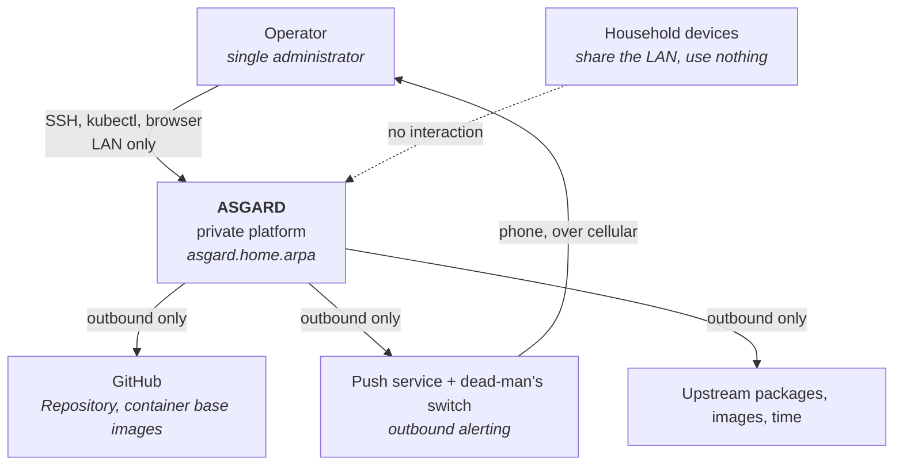
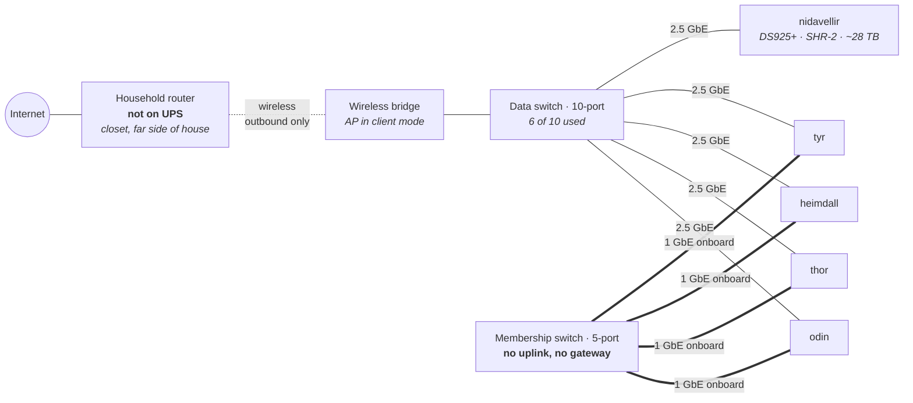
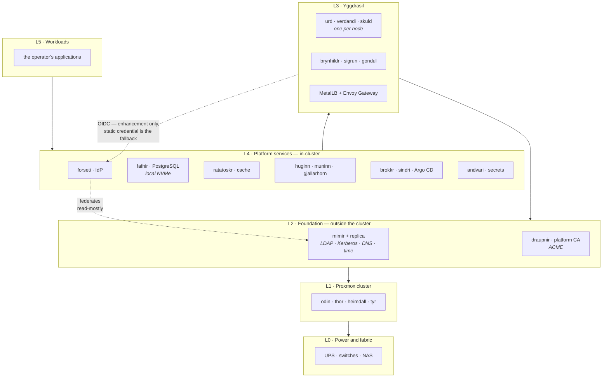
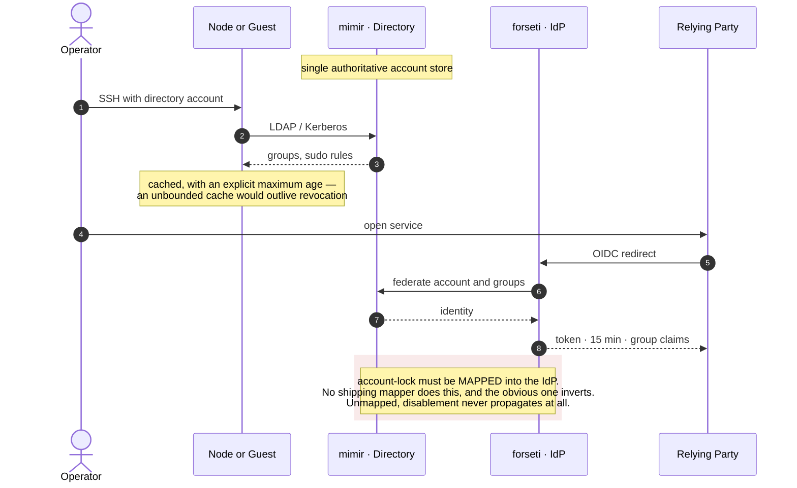
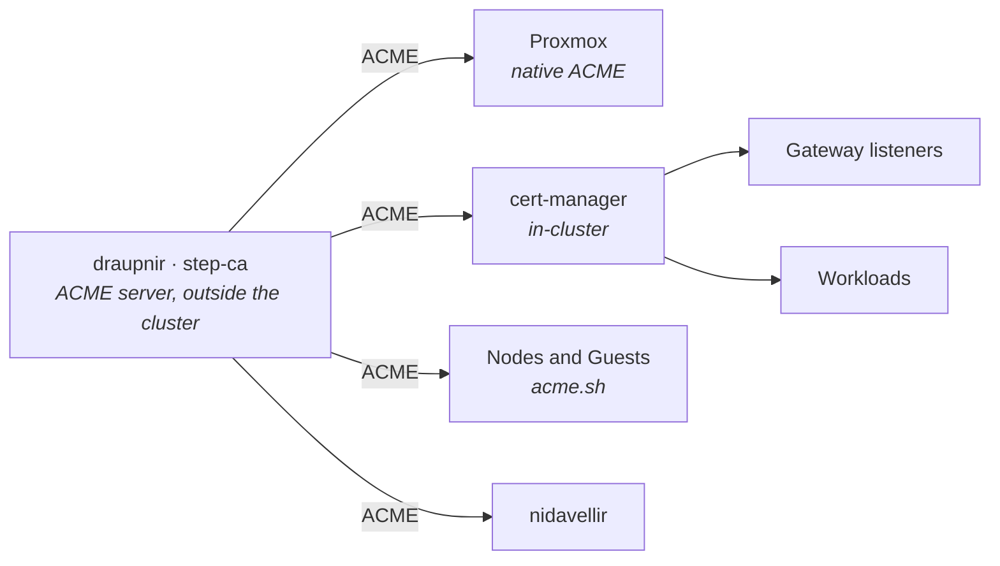
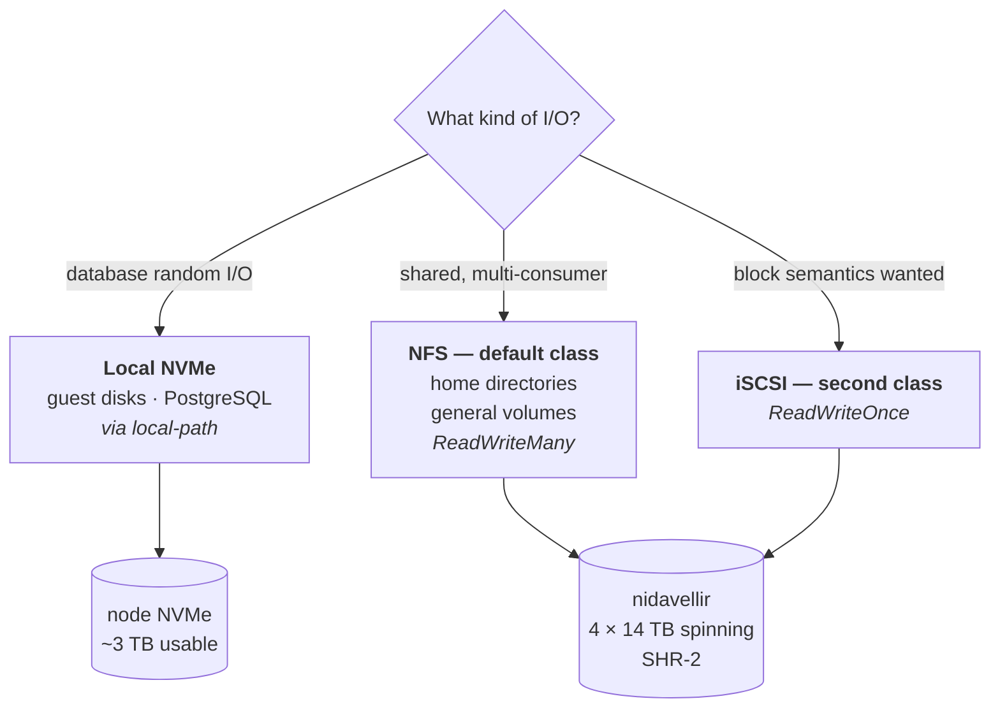
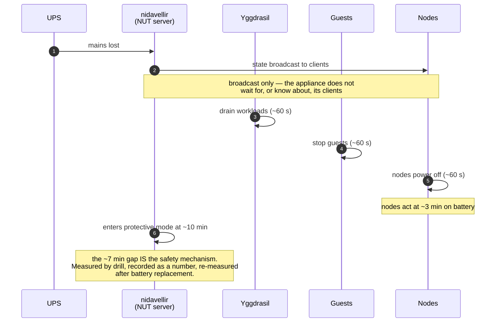
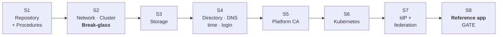

# Project Asgard — Diagram Set

Views of the same system at different altitudes. Each carries a rule or a mechanism that prose states less clearly; none is decorative. Where a diagram and the spine disagree, the spine wins.

## 1. Context — who and what touches Asgard

**The rule this carries:** every arrow leaving Asgard is outbound. There is no inbound path — no VPN, no tunnel, no published service. The only route that reaches the operator when the platform is down runs *through* an external service, which is why the dead-man's switch is load-bearing rather than supplementary.

## 2. Physical and network topology

**The rule this carries:** two traffic classes never share a link *or* a switch. Bold edges are cluster membership on the onboard NICs; thin edges are storage, pods, backups and outbound on the USB 2.5 GbE adapters. The membership switch deliberately connects to nothing else — joining the two switches would return membership to shared fabric and forfeit the separation.

**The trap it shows:** the router sits outside the UPS boundary, so a whole-house power failure severs every outbound path at once.

## 3. Layers and placement

**The rule this carries:** solid arrows are permitted dependencies and point only downward. The two dotted arrows are the exceptions that prove it — Keycloak federating *down* to the directory is fine, and Kubernetes using Keycloak is an enhancement with a static-credential fallback, never a dependency. Only two services sit outside the cluster, and each met a named test.

## 4. Identity — one account, two protocols

**The mechanism this carries:** the directory is the only account store; Keycloak holds sessions and clients, never identity, so it can be rebuilt without loss. Revocation is one action with bounded — not instant — propagation.

## 5. Certificates — one protocol, four consumers

**The rule this carries:** ACME is the *only* issuance path. Four consumers with nothing else in common all speak it, which turns automatic renewal from four bespoke problems into one. Manual installation is prohibited so the bespoke problems cannot creep back.

## 6. Storage placement by I/O class

**The rule this carries:** placement follows I/O class, never convenience. The NAS is HDD-only, so *nothing* database-shaped lands there by any protocol — the exclusion is about the medium, not about NFS. Both NAS classes share the same spindles, so iSCSI buys semantics, not speed.

## 7. Ordered shutdown — margin, not handshake

**The mechanism this carries:** there is no coordination to rely on. Ordering is produced by configured delays sized larger than the measured shutdown time — a race engineered to be unlosable. The drill exists to prove the margin, not to confirm a guarantee.

## 8. Build order — walking skeleton

**The constraints this carries:** break-glass precedes directory login, or a lockout has no independent way in. Name resolution is provisional until S4 delivers the resolver that serves the domain. The CA precedes the cluster because it lives outside it; the IdP follows the cluster because it lives inside it. Reaching S8 proves every integration seam while each is still cheap to change.
